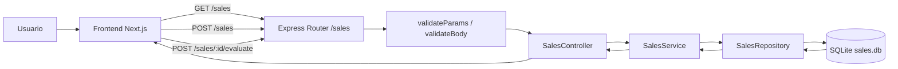

# Sales App 

Aplicación full stack simple para registrar ventas y evaluarlas con score de 1 a 5.

## Stack

- Backend: Node.js + Express + TypeScript
- Frontend: Next.js + TypeScript + Tailwind
- Base de datos: SQLite
- Orquestación: Docker Compose

## Requisitos previos

- Node.js 20+
- npm 10+
- Docker 

## Frontend (Next.js)

El frontend está implementado con Next.js.

- `npm run dev`: ejecuta el frontend en desarrollo.
- `npm run build`: genera build de producción.
- `npm run start`: ejecuta el build de producción.
- `npm run lint`: valida calidad de código con ESLint.

## Funcionalidad

- Crear ventas con cliente, producto y monto.
- Listar ventas.
- Evaluar cada venta con score de 1 a 5.
- Navegación simple con 3 menús: Inicio, Ventas y Evaluar.
- Promedio de score visible en vistas de ventas/evaluación.

## Instalación de dependencias

Instala dependencias en backend y frontend:

```bash
cd backend
npm install

cd  frontend
npm install
```

## Ejecutar con Docker

Desde la raíz del proyecto:

```bash
docker compose up
```

Primera ejecución o después de cambios de Dockerfile/dependencias:

```bash
docker compose up --build
```

Servicios:

- Frontend: http://localhost:3000
- Backend: http://localhost:4000
- Health check backend: http://localhost:4000/health

## Endpoints backend

Base path: `/sales`

- `GET /health`
  - Verifica que el backend esté activo.
  - Respuesta: `200 {"status":"ok"}`.

- `POST /sales`
  - Crea una venta nueva.
  - Body:

```json
{
  "customer": "Acme",
  "product": "Laptop",
  "amount": 1200
}
```

- `GET /sales`
  - Lista ventas en orden descendente por id.
  - Respuesta: `200 { data: Sale[] }`.

- `POST /sales/:id/evaluate`
  - Actualiza el score (1 a 5) de una venta existente.
  - Body:

```json
{
  "score": 4
}
```

## Notas de validación

- `customer` y `product`: obligatorios.
- `amount`: número positivo.
- `id`: entero positivo.
- `score`: entero entre 1 y 5.

## Consideraciones

- Arquitectura en capas clara: rutas -> controlador -> servicio -> repositorio.
- Validación centralizada con Zod en middleware reutilizable.
- Manejo de errores centralizado con respuestas HTTP consistentes.
- Restricciones también en base de datos SQLite (`CHECK` para `amount` y `score`).
- Tests unitarios para controlador y validaciones.

## Diagrama de arquitectura (Mermaid)



## Desarrollo local (sin Docker)

Backend:

```bash
cd backend
npm run dev
```

Frontend:

```bash
cd frontend
npm run dev
```

## Estructura resumida

- `backend/src/controllers`: capa HTTP
- `backend/src/services`: lógica de negocio
- `backend/src/repositories`: persistencia SQLite
- `frontend/src/components/sales`: módulos de interfaz de ventas
- `frontend/src/lib/api.ts`: cliente API tipado
- `frontend/src/app`: páginas de Inicio, Ventas y Evaluar
